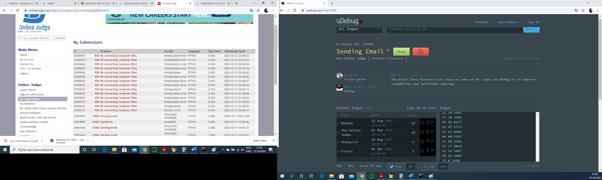

# Trabalho de Programação -- Algoritmos Gulosos –- Parte 3
**Autor:** Edimar Antonio da Cruz
**Data:** 12 de outubro de 2020
**Problema:** 10986 -- – Sending email
## Sobre a Solução
Este diretório contém o código fonte gerado para solucionar o problema 10986
do *Online Judge*. O problema recebeu veredito \Time limit exceeded", como mostrado na
figura abaixo:

O programa foi desenvolvido em Python
O código atendeu aos casos testes na página do problema, porém quando sujeitado ao
debug ele não rodou com eficiência
